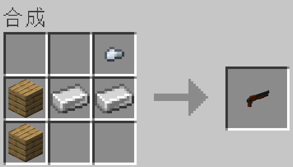
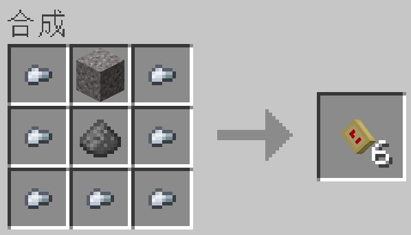
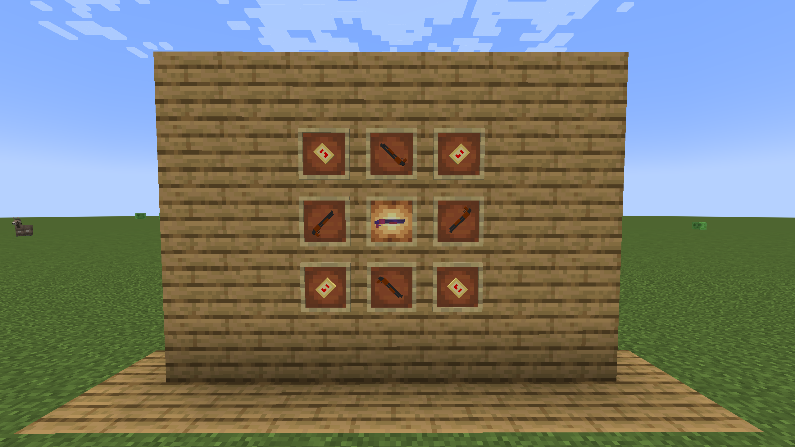

# 霰弹枪模组 - 开发者文档

by [Jaffe2718](https://github.com/Jaffe2718/)

## 开发环境配置

> ### 依赖项目
> 
> | 项目  | 要求配置                     | 推荐配置                           |
> | --- | ------------------------ | ------------------------------ |
> | IDE | Jetbrains IDEA / Eclipse | JetBrains IDEA                 |
> | JDK | Java 17                  | Java SE Development Kit 17.0.6 |

> ### 配置步骤
> 
> 1. 安装JDK环境和IDE；
> 
> 2. 克隆仓库代码 `git clone https://github.com/Jaffe2718/Fabric-Shotgun-Mod-1.19.2-MDK.git`；
> 
> 3. 加载Gradle任务。

## 模组使用

> - 需要自行安装好Minecraft Java Edition 1.19.2；
> 
> - 需要版本高于0.14.9的Fabric Loader；
> 
> - 需要Fabric API作为前置模组；
> 
> - 将对应版本的模组JAR文件放入Minecraft安装位置`mods`文件夹。

## 玩法说明

> - 本模组添加了霰弹枪，需要2个铁锭，1个铁粒，2个木材合成，具体合成方法如下：
>   
>   
> 
> - 霰弹枪使用12mm大口径霰弹作为弹药，具体合成方式如下：
>   
>   
> 
> - 霰弹枪的伤害会随着距离大幅度衰减，最远射程越40米。
> 
> - 霰弹枪支持多重射击附魔，附有多重射击的霰弹枪单次开火会喷射2次霰弹；
> 
> - 附有穿透附魔的霰弹枪会增加霰弹喷出的密度，也会适当提升霰弹的伤害；
> 
> - 合成霰弹枪可以解锁成就——喷射战皇；
> 
> - 更多玩法有待玩家自行探索；
> 
> ### 更新内容
> 
> > - 解决了安装OptiFabric后霰弹枪装子弹动作受到影响的问题。
> 
> 

## 快速链接

[bilibili个人主页](https://space.bilibili.com/1671742926)

[源码远程仓库](https://github.com/Jaffe2718/Fabric-Shotgun-Mod-1.19.2-MDK)

[Issues](https://github.com/Jaffe2718/Fabric-Shotgun-Mod-1.19.2-MDK/issues)

[Fabric Wiki](https://fabricmc.net/wiki/doku.php)

[Fabric API 下载](https://www.mcmod.cn/class/3124.html)
